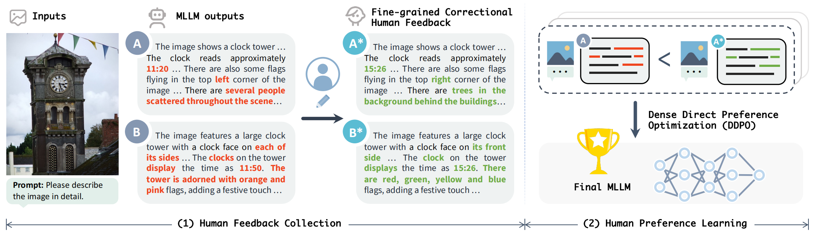
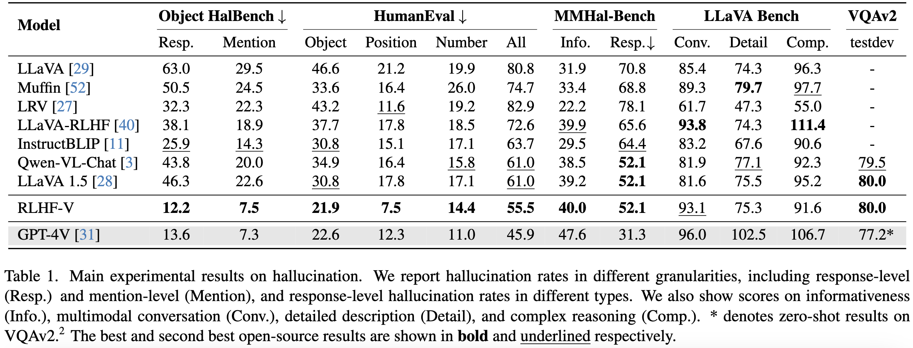
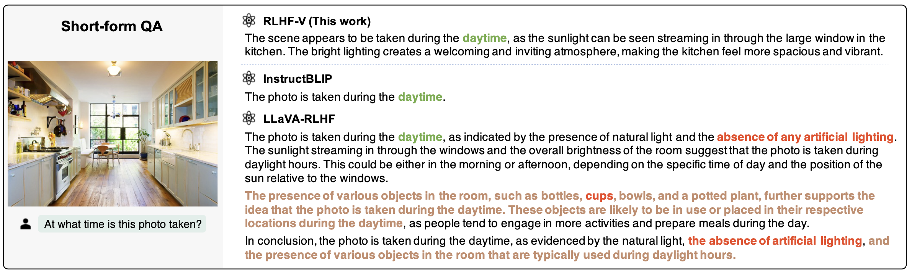
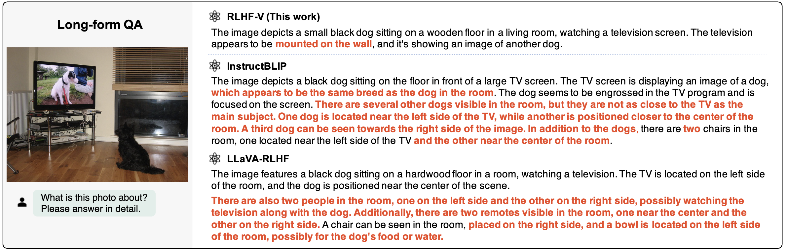

<div align="center">

# 🏆 RLHF-V: Towards Trustworthy MLLMs via Behavior Alignment from Fine-grained Correctional Human Feedback

<p align="center">
  <a href="http://120.92.209.146:8081/">🔥 Try It Now!</a> •
  <a href="#Install">🔧 Install</a> •
  <a href="#RLHF-V Training"> 🙌 Build Your RLHF-V Model </a> •
  <a href="#"> 📄 Our Paper </a>
</p>

</div>

**RLHF-V** is a novel framework that aligns Multimodal Large Language Models (MLLMs) behavior through fine-grained correctional human feedback. At the data level, we collect human feedback in the form of **fine-grained segment-level corrections**. At the method level, we propose **dense direct preference optimization (DDPO)**, a new variant of DPO that addresses the traditional RLHF objective in an equivalent simple and efficient supervised fashion. Comprehensive experiments demonstrate the effectiveness of the proposed framework, achieving state-of-the-art performance in trustworthiness among open-source MLLMs.

### Models

We utilize the RLHF-V method to Muffin, a MLLM that has a strong ability in image understanding and reasoning. Remarkably, using 1.4k annotated data samples, RLHF-V significantly reduces the hallucination rate of the base model by 34.8%, resulting in a more trustworthy MLLM. We list some [examples](#examples) generated by our RLHF-V model to demonstrate its effectiveness.

### Framework

The RLHF-V framework for MLLM behavior alignment from human feedback. (1) Given the input image and prompt, we obtain outputs from MLLMs and collect human feedback in the form of fine-grained segment-level corrections on hallucinations. (2) During human preference learning, we perform dense direct preference optimization over the fine-grained correctional human feedback.



### Benchmarks




## Examples

We show the cases of our RLHF-V model in two representative scenarios: (1) Short-form QA (i.e., questions that can be sufficiently answered in a few words). RLHF-V typically maintains a good balance between helpfulness, engagement, and clarity. (2) Long-form QA (i.e., questions that require long text to answer). RLHF-V introduces significantly fewer hallucinations while delivering a comparable amount of effective information. 

### Short-form QA




### Long-form QA




## Contents
- [RLHF-V Data](#RLHF-V Data)
- [RLHF-V Weights](#RLHF-V Weights)
- [Install](#install)
- [Evaluation](#evaluation)
- [Fine-tuning](#DDPO Training)

## RLHF-V Data

We present the RLHF-V-Hall dataset, which is a human preference dataset constructed by fine-grained segment-level human corrections. In practice, we obtain a total of 1.4k annotated data that includes a diverse set of detailed description instructions and question answering instructions.

You can download our RLHF-V-Hall dataset from [RLHF-V-Hall_v0]((https://huggingface.co/datasets/HaoyeZhang/RLHF-V-Hall_v0/tree/main)).

## RLHF-V Weights

We release RLHF-V model weights on [Hugging Face](https://huggingface.co/Yirany/RLHF-V_v0/tree/main). 

We also provide the [MuffinQA weights](https://huggingface.co/Yirany/MuffinQA/tree/main) (uploading, will be available soon), which is the model checkpoint after finetuning Muffin on VQAv2 dataset. This model also serve as the base model when training RLHF-V.

## Install

Please follow the instructions in the [original repository]((https://github.com/thunlp/muffin#install)) to install Muffin.

## Evaluation

The evaluation process is identical to the Muffin project, simply follow the instructions in [Muffin evaluation]((https://github.com/thunlp/Muffin#evaluation)) for deployment.

## RLHF-V Training

1. Prepare training data

Please download our [RLHF-V-Hall_v0 dataset]((https://huggingface.co/datasets/HaoyeZhang/RLHF-V-Hall_v0/tree/main)), and save it to the following directory:

```
./data/RLHF-V-Hall_v0
```

2. Prepare model checkpoint

Please download our MuffinQA model checkpoint.

3. Training

After install the environment of Muffin, the RLHF-V Training can be run as follows: 
```
cd Muffin

ref_model=../MuffinQA # your model path to MuffinQA checkpoint

bash ./script/train/run_RLHFV.sh ../RLHFV_checkpoints/dpo_exp master RLHFV 5.0 $ref_model dpo_cvpr_docrp_vqa 1 320 40 True True
```

## Licenses


[](https://github.com/tatsu-lab/stanford_alpaca/blob/main/LICENSE)
[](https://github.com/tatsu-lab/stanford_alpaca/blob/main/DATA_LICENSE)

**Usage and License Notices**: The data, code and checkpoint is intended and licensed for research use only. They are also restricted to uses that follow the license agreement of LLaMA, Vicuna and Chat GPT. The dataset is CC BY NC 4.0 (allowing only non-commercial use) and models trained using the dataset should not be used outside of research purposes.


## Acknowledgement

- [Muffin](https://github.com/thunlp/muffin): the codebase we built upon.

If you find RLHF-V useful for your your research and applications, please cite using this BibTeX:
```bibtex
@misc{yu2023muffin,
      title={Reformulating Vision-Language Foundation Models and Datasets Towards Universal Multimodal Assistants},
      author={Tianyu Yu, Jinyi Hu, Yuan Yao, Haoye Zhang, Yue Zhao, Chongyi Wang, Shan Wang, Yinxv Pan, Jiao Xue, Dahai Li, Zhiyuan Liu, Hai-Tao Zheng, Maosong Sun},
      publisher={arXiv:2310.00653},
      year={2023},
}
```
